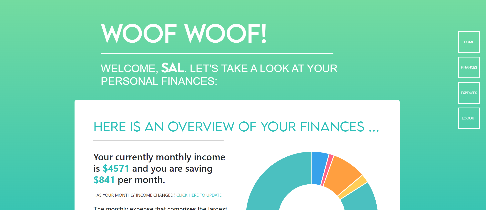

# **Wallet Watchdog** 

> You're a Github user and tech enthusiast looking to support new repositories while also needing an application to help you manage your finances. Introducing... **Wallet Watchdog**. Tell your digital dog about your finances and help manage your expenses by setting monthly goals and limits for yourself. Your wallet watchdog will help you visualize your expenses and adjust your budgets accordingly.


## **Table of Contents**

- [**Wallet Watchdog**](#wallet-watchdog)
  - [**Table of Contents**](#table-of-contents)
  - [**Features**](#features)
    - [**Front-End**](#front-end)
    - [**Back-End**](#back-end)
  - [**Roadmap**](#roadmap)
  - [**Installation**](#installation)
  - [**Usage Instructions**](#usage-instructions)
  - [**Project Process**](#project-process)
    - [**User Story**](#user-story)
    - [**Task Breakdown**](#task-breakdown)
    - [**User Flow and Wire Frames**](#user-flow-and-wire-frames)
  - [**GitHub and Team**](#github-and-team)


## **Features**
The deployed application and repository contains the following features:

### **Front-End**
- Semantic HTML structuring for accessibility.
- Guided comments along CSS and JavaScript files to navigate structure.
- Thirty-Party CSS Frameworks including: Bootstrap, Chart.js
- Media query and flexboxes for various resolutions and devices.

### **Back-End**
- HTML is formatted in Handlebars for style consistency, templating, and streamlining code.
- Makes use of third party packages including: Node.JS, Express, MySQL, Sequelize, Handlebars, Evr-Prettier, and EsLint.
- Controllers define routes for HTTPS requests and requesting and returning data from the server.
- Makes use of models to define and store data (i.e. user data, wallet, expenses).

## **Roadmap**

The application could be improved by integrating the following:

- **Improved functionality**: The repository meets minimum viable project requirements to demo as a proof of concept. However, there are some features that are missing, including: logout logic, ability to delete and/or modify data values (i.e. monthly expenses), collecting specific data values (monthly income), and loading different data types onto the handlebars pages.

- **Aesthetic Direction**: The repository could make more use of CSS transitions, animations, smooth scrolling, and overall UI/UX improvements. Additionally, the application could be optimized for mobile and lower device resolutions.

- **Concept Direction**: The repository could expand to collect more data beyond monthly income and recurring expenses, and provide more complex data insight and consulting.

## **Installation**

Copy the HTTPS or SSH key into your terminal and perform a git pull to create a local copy of the repository. A copy of this repository can be cloned using either of the following codes:

**HTTPS**: 
> `https://github.com/brennantaylor98/Wallet-Watchdog.git`

**SSH**:
> `git@github.com:brennantaylor98/Wallet-Watchdog.git`

Once you have cloned a copy of the repository, navigate to the repository and install the necessary third-party packages using `npm i`. 

If running on a local port, you will need to set up a mySQL database. Create a .env file with the following parameters:

```
DB_NAME='wallet_db'
DB_USER='{username}'
DB_PASSWORD='{password}'
```
>> **NOTE**: You must input your local mySQL username and password. The .env file is ignored in the .gitignore if you decide to fork or make a commit to the repository.

Log into mySQL and run the schema. Then, run the test seeds using `node ./seeds/seed.js`. Afterwards, run `node server.js` and you will be able to run it locally.

The application can also be deployed to Heroku. Open the repository in the terminal and run `npm i heroku`. Log into your Heroku and perform a `git init`, `git add -A`, and `git commit -m "{comment}"`. Then, input `heroku create` and run `git push heroku main`. 

## **Usage Instructions**

On the Wallet Watchdog homepage, log in by pressing the **Login** button. Supply the username and password credentials, and then press **Login**. If successful, this will redirect you to the dashboard. Otherwise, press **Register to create an account**.

On the Wallet Watchdog dashboard, scroll down to input monthly recurring expenses. Click **Click to add a monthly expense** and input a value for **Expense Name** and **Dollar Amount**. 




## **Project Process**

This section covers the concept realization and processes behind the creation of Wallet Watchdog.

### **User Story**

**GIVEN** a user opens the application, **THEN** they will see the homepage displayed on their screen.

**GIVEN** a user clicks on the sign in/ sign up button, **THEN** they will be prompted to create a profile or login using their existing credentials.

**GIVEN** the user has logged into their account, **THEN** they will see a dashboard displaying their monthly expenses breakdown, recurring payments and a GOAL bar for the user to input how much they want to save.

**GIVEN** a user wants to track and manage their monthly expenses **THEN** the user can input their costs for each expense and add any recurring monthly charges.

### **Task Breakdown**
- [ ] Styling (CSS & Handlebars)
- [ ] Routes and API Controllers
- [ ] Index ('/')
- [ ] Login
- [ ] Create User Account
- [ ] Logout
- [ ] Dashboard
- [ ] User Accounts Persistence
- [ ] Collecting User Inputs
- [ ] Data Visualization
- [ ] User Goals
- [ ] Server Logic


### **User Flow and Wire Frames**

The following wireframe conceptualized the overall aesthetic and vision for the project.


## **GitHub and Team**

[The Wallet Watchdog Repository can be found on Github](https://github.com/brennantaylor98/Wallet-Watchdog), and was created by the following individuals:

- [Brennan Taylor](https://github.com/brennantaylor98)
- [Christian Gella](https://github.com/christiangella)
- [Timothy Cook](https://github.com/Tcook160)
- [Xenon Santillian](https://github.com/Xenon789)

Questions, comments, and concerns can be created as issue tickets on GitHub.

This repository was developed for the UC Davis Fullstacks Bootcamp under the UC Davis Continuing and Professional Education.


