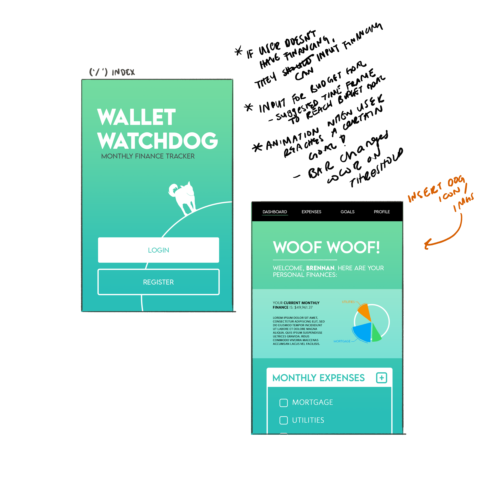

# **Wallet Watchdog** 

## *Table of Contents*
1.  [User Story](#user-story)
2.  [Concept](#concept)
3.  [Installation](#installation)
4.  [Usage](#usage)
5.  [Wireframe](#wireframe)
6.  [Contributors](#contributors)
7.  [License](#license)
8.  [Technologies](#technologies)

## *User-Story*
**GIVEN** a user opens the application   **THEN** they will see the homepage displayed on their screen.  
**GIVEN** a user clicks on the sign in/ sign up button   **THEN** they will be prompted to login using their credentials.  
**GIVEN** the user has logged into their account   **THEN** they will see a dashboard displaying their monthly expenses breakdown, and recurring payments.  
**GIVEN** a user wants to track and manage their monthly expenses   **THEN** the user can input their costs for each expense and add any recurring monthly charges.

## *Concept*
    You're a Github user or tech enthusiast looking to support new repositories while also needing an application to help you manage your finances. Introducing the Wallet Watchdog. Tell your digital dog about your finances and help manage your expenses by setting monthly goals and limits for yourself. Your wallet watchdog will help you visualize your expenses and adjust your budgets accordingly.

[**Application Demo**](http://google.com)

## *Installation*
You are not required to install this application as it is deployed on heroku at:  [Wallet Watchdog App](https://wallet-watchdog.herokuapp.com/)

## *Usage*
    Navigate to the homepage -- sign in/sign up -- enter expense details/reoccuring payments. You may update these expenses at will, in addition to creating monthly reoccuring payments, to keep track of all and any fiances you may accrue.

## *Wireframe*

## *Contributors*
- [**Brennan Taylor**](https://github.com/brennantaylor98)

- [**Christian Gella**](https://github.com/christiangella)

- [**Timothy Cook**](https://github.com/Tcook160)

- [**Xenon Santillian**](https://github.com/Xenon789)

## *License*

## *Technologies*
- D3.js Data Visualization
- Chart.js
- Sequelize
- Node.js
- Handlebars.js
- MySQL
- Express.js
- Evr-Prettier
- EsLint
